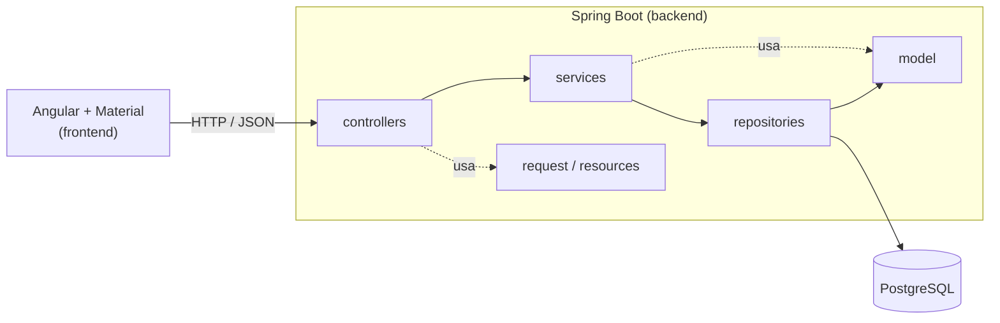

# Estoque

Sistema de controle de estoque com **API REST em Java/Spring Boot** e **interface web em Angular Material**.
Cadastre categorias e produtos, registre entradas e saídas e acompanhe o saldo, o valor em estoque e os itens que estão acabando.


## Sumário

- [Funcionalidades](#funcionalidades)
- [Tecnologias](#tecnologias)
- [Arquitetura](#arquitetura)
- [Estrutura do repositório](#estrutura-do-repositório)
- [Como executar](#como-executar)
- [Documentação da API (Scalar)](#documentação-da-api-scalar)
- [Endpoints](#endpoints)
- [Exemplos de resposta](#exemplos-de-resposta)
- [Regras de negócio](#regras-de-negócio)
- [Configuração](#configuração)
- [Testes](#testes)
- [Decisões de projeto](#decisões-de-projeto)
- [Próximos passos](#próximos-passos)
- [Licença](#licença)

## Funcionalidades

- **Categorias**: listar com paginação e busca por nome, buscar por id, cadastrar, atualizar e excluir.
- **Produtos**: listar com paginação, ordenação e busca por nome ou SKU, filtrar por categoria e situação, buscar por id, cadastrar, atualizar e excluir.
- **Movimentações**: registrar entradas e saídas (o saldo é atualizado automaticamente), consultar o histórico paginado e filtrar por produto.
- **Painel**: total de produtos, categorias, unidades e valor em estoque, produtos com estoque baixo e últimas movimentações.
- Respostas, mensagens de erro e validações **em português**.
- Dados de exemplo (produtos brasileiros reais) carregados automaticamente no primeiro start.

## Tecnologias

| Camada | Tecnologias |
|---|---|
| Backend | Java 21, Spring Boot 3.5, Spring Data JPA (Hibernate), Bean Validation, Lombok |
| Banco de dados | PostgreSQL 16 |
| Documentação | springdoc-openapi + [Scalar](https://scalar.com) |
| Frontend | Angular 20, Angular Material (Material 3), TypeScript, RxJS, Signals |
| Testes | JUnit 5, Mockito, Spring MockMvc, Jasmine/Karma |
| Infra | Docker Compose, GitHub Actions |

## Arquitetura



O backend segue uma arquitetura em camadas, com o fluxo `controller → service → repository → model`:

| Pacote (`com.estoque.api`) | Responsabilidade |
|---|---|
| `controllers` | Endpoints REST. Só conhecem `request` e `resources`; não têm regra de negócio. |
| `services` | Regras de negócio e transações. |
| `repositories` | Acesso a dados (Spring Data JPA e filtros dinâmicos). |
| `model` | Entidades JPA (`Categoria`, `Produto`, `MovimentacaoEstoque`). |
| `request` | Dados de entrada com validação (Bean Validation). |
| `resources` | Dados de saída. As entidades nunca são expostas diretamente. |
| `exceptions` | Exceções de domínio e tratamento global de erros em português. |
| `config` | CORS, OpenAPI e carga de dados iniciais. |

## Estrutura do repositório

```
estoque-api/
├── backend/                 # API Spring Boot (Maven)
│   ├── src/main/java/com/estoque/api/...
│   ├── src/test/java/...
│   ├── Dockerfile
│   └── pom.xml
├── frontend/                # Aplicação Angular (npm)
│   ├── src/app/
│   │   ├── core/            # modelos, serviços HTTP, interceptor de erros
│   │   ├── shared/          # componentes reutilizáveis
│   │   └── features/        # painel, produtos, categorias, movimentações
│   ├── Dockerfile
│   └── package.json
├── docs/requisicoes.http    # requisições prontas para o HTTP Client do IntelliJ
├── docker-compose.yml       # PostgreSQL (e, opcionalmente, API + front)
└── .github/workflows/ci.yml # build e testes no GitHub Actions
```

## Como executar

### Pré-requisitos

- JDK 21 ou superior
- Node.js 20.19+ ou 22.12+ (e npm)
- Docker Desktop (para o PostgreSQL)

### Opção 1 — Desenvolvimento no IntelliJ IDEA

1. Abra a **pasta raiz** `estoque-api` no IntelliJ (*File → Open*).
2. **Backend**: se o IntelliJ não reconhecer o Maven sozinho, abra o painel *Maven*, clique em **+** e escolha `backend/pom.xml`. Em *File → Project Structure → SDK*, selecione o JDK 21+. Confirme que *Settings → Build, Execution, Deployment → Compiler → Annotation Processors → Enable annotation processing* está marcado (necessário para o Lombok).
3. **Banco**: no terminal, na raiz do projeto:
   ```bash
   docker compose up -d
   ```
4. **API**: execute a classe `EstoqueApplication` (`backend/src/main/java/com/estoque/api`). Ela sobe em `http://localhost:8080` e, na primeira vez, cria as tabelas e carrega os dados de exemplo.
5. **Front**: em outro terminal:
   ```bash
   cd frontend
   npm install
   npm start
   ```
   Acesse `http://localhost:4200`. Em desenvolvimento, o Angular encaminha `/api` para `http://localhost:8080` (arquivo `frontend/proxy.conf.json`).

> O IntelliJ IDEA Ultimate tem suporte completo a Angular. Na edição Community o front pode ser editado como texto; se preferir, abra a pasta `frontend` no VS Code.

### Opção 2 — Tudo com Docker

```bash
docker compose --profile completo up -d --build
```

- Front: http://localhost:4200
- API: http://localhost:8080
- Documentação: http://localhost:8080/scalar

Para parar: `docker compose --profile completo down` (acrescente `-v` para apagar também os dados do banco).

### Se a porta 8080 estiver ocupada

Rode a API em outra porta com a variável `SERVER_PORT` (no IntelliJ: *Run → Edit Configurations → Environment variables*, por exemplo `SERVER_PORT=8081`) e altere o `target` em `frontend/proxy.conf.json` para `http://localhost:8081`.

## Documentação da API (Scalar)

Com a API no ar, abra **http://localhost:8080/scalar** para ver e testar todos os endpoints.
O contrato OpenAPI em JSON fica em http://localhost:8080/v3/api-docs.

> A página do Scalar carrega o script de um CDN (`cdn.jsdelivr.net`), então precisa de internet.

Se preferir, o arquivo [`docs/requisicoes.http`](docs/requisicoes.http) traz uma requisição pronta para cada endpoint, para usar direto no IntelliJ.

## Endpoints

Todas as listagens aceitam `pagina` (começa em 0), `tamanho` (máximo 100), `ordenarPor` e `direcao` (`asc` ou `desc`).

| Método | Rota | Descrição |
|---|---|---|
| GET | `/api/categorias?busca=` | Lista categorias (paginado, busca por nome). Ordenação: `id`, `nome` |
| GET | `/api/categorias/todas` | Lista todas, sem paginação (para listas de seleção) |
| GET | `/api/categorias/{id}` | Busca por id |
| POST | `/api/categorias` | Cadastra |
| PUT | `/api/categorias/{id}` | Atualiza |
| DELETE | `/api/categorias/{id}` | Exclui (só se não tiver produtos) |
| GET | `/api/produtos?busca=&categoriaId=&ativo=` | Lista produtos (paginado, busca por nome ou SKU). Ordenação: `id`, `nome`, `sku`, `preco`, `quantidade` |
| GET | `/api/produtos/estoque-baixo` | Produtos ativos com saldo ≤ estoque mínimo |
| GET | `/api/produtos/{id}` | Busca por id |
| POST | `/api/produtos` | Cadastra (saldo inicial zero) |
| PUT | `/api/produtos/{id}` | Atualiza os dados (não altera o saldo) |
| DELETE | `/api/produtos/{id}` | Exclui; se já tiver movimentações, apenas desativa |
| GET | `/api/movimentacoes?produtoId=` | Histórico (paginado). Ordenação: `id`, `criadoEm`, `quantidade`, `tipo` |
| GET | `/api/movimentacoes/{id}` | Busca por id |
| POST | `/api/movimentacoes` | Registra `ENTRADA` ou `SAIDA` |
| GET | `/api/painel/resumo` | Indicadores do painel |

## Exemplos de resposta

Listagem paginada — `GET /api/produtos?busca=arroz&tamanho=5`:

```json
{
  "itens": [
    {
      "id": 4,
      "nome": "Arroz Tio João Tipo 1 5kg",
      "sku": "MER-001",
      "descricao": "Pacote 5kg",
      "preco": 29.90,
      "quantidade": 45,
      "estoqueMinimo": 20,
      "estoqueBaixo": false,
      "ativo": true,
      "categoria": { "id": 2, "nome": "Mercearia", "descricao": "Alimentos básicos e não perecíveis" }
    }
  ],
  "pagina": 0,
  "tamanho": 5,
  "totalItens": 1,
  "totalPaginas": 1,
  "primeira": true,
  "ultima": true
}
```

Erro de validação — `POST /api/produtos` com corpo inválido (`400`):

```json
{
  "status": 400,
  "erro": "Dados inválidos",
  "mensagem": "Um ou mais campos estão inválidos",
  "campos": {
    "nome": "O nome é obrigatório",
    "categoriaId": "A categoria é obrigatória"
  },
  "dataHora": "2026-10-09T22:30:00"
}
```

Regra de negócio — saída maior que o saldo (`422`):

```json
{
  "status": 422,
  "erro": "Regra de negócio violada",
  "mensagem": "Estoque insuficiente. Saldo atual: 45",
  "campos": null,
  "dataHora": "2026-10-09T22:31:10"
}
```

| Status | Quando |
|---|---|
| 400 | Dados inválidos, JSON malformado, parâmetro ou ordenação inválidos |
| 404 | Registro ou rota inexistente |
| 409 | Violação de integridade do banco (valor duplicado, registro em uso) |
| 422 | Regra de negócio violada (SKU duplicado, estoque insuficiente, categoria com produtos...) |
| 500 | Erro inesperado (detalhes apenas no log do servidor) |

## Regras de negócio

- O saldo de um produto **só muda por movimentações**: `ENTRADA` soma e `SAIDA` subtrai. Cadastrar ou editar um produto nunca altera o saldo.
- Uma saída maior que o saldo é recusada (`422`), e o saldo nunca fica negativo. Duas saídas simultâneas não furam o estoque porque a linha do produto é travada durante a movimentação.
- O **SKU** é único e salvo em maiúsculas. O nome da **categoria** também é único.
- Produtos inativos não recebem movimentações.
- Excluir um produto **sem movimentações** o remove; **com movimentações**, ele é apenas desativado, para preservar o histórico.
- Uma categoria só pode ser excluída se não tiver produtos.
- Movimentações não podem ser editadas nem excluídas (trilha de auditoria). Para corrigir um erro, registre a movimentação contrária.
- Um produto está com **estoque baixo** quando `quantidade ≤ estoqueMinimo`.

## Configuração

O backend lê estas variáveis de ambiente (todas têm valor padrão para desenvolvimento):

| Variável | Padrão | Descrição |
|---|---|---|
| `SERVER_PORT` | `8080` | Porta da API |
| `DB_URL` | `jdbc:postgresql://localhost:5432/estoque` | URL do PostgreSQL |
| `DB_USER` | `estoque` | Usuário do banco |
| `DB_PASSWORD` | `estoque` | Senha do banco |
| `DDL_AUTO` | `update` | Estratégia do Hibernate (`update`, `validate`, `none`) |
| `CORS_ORIGENS` | `http://localhost:4200` | Origens permitidas, separadas por vírgula |
| `SEED_ENABLED` | `true` | Carrega dados de exemplo quando o banco está vazio |

As credenciais do `docker-compose.yml` e do `application.yml` são apenas para desenvolvimento local. Em produção, use variáveis de ambiente ou um cofre de segredos.

## Testes

```bash
# Backend (JUnit, Mockito e MockMvc — não precisam de banco)
cd backend
mvn test

# Frontend (Jasmine/Karma em Chrome headless)
cd frontend
npm run test:ci
```

O workflow de [integração contínua](.github/workflows/ci.yml) executa o build e os testes do backend e do front a cada push e pull request.

## Decisões de projeto

- **Um repositório com duas pastas (monorepo).** Front e back evoluem juntos neste projeto e compartilham o mesmo contrato de API, então uma única história de commits, um único README e um único `docker compose` simplificam o dia a dia. Como as pastas são independentes (cada uma com seu build), é simples separá-las em dois repositórios no futuro, se a equipe ou o deploy pedirem.
- **DTOs separados das entidades** (`request` e `resources`), para que o contrato da API não dependa do modelo do banco.
- **Paginação e ordenação sempre validadas** contra uma lista de campos permitidos, evitando ordenar por campos internos.
- **Remoção lógica quando há histórico**, para não perder a rastreabilidade das movimentações.
- **Proxy no front em desenvolvimento**, para que o código use sempre `/api` (igual à produção, onde o Nginx faz o mesmo papel) e não dependa de CORS.

## Próximos passos

- Autenticação e perfis de acesso (Spring Security + JWT).
- Migrações de banco com Flyway no lugar de `ddl-auto: update`.
- Testes de integração com Testcontainers.
- Relatórios e exportação para CSV/PDF.
- Filtros de período na tela de movimentações.

## Licença

Distribuído sob a licença MIT. Veja o arquivo [LICENSE](LICENSE).
